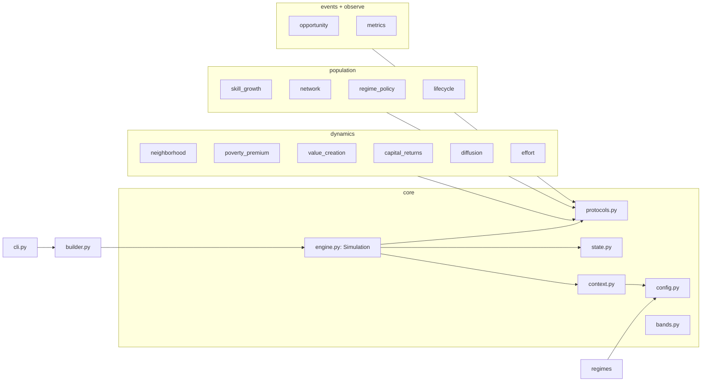
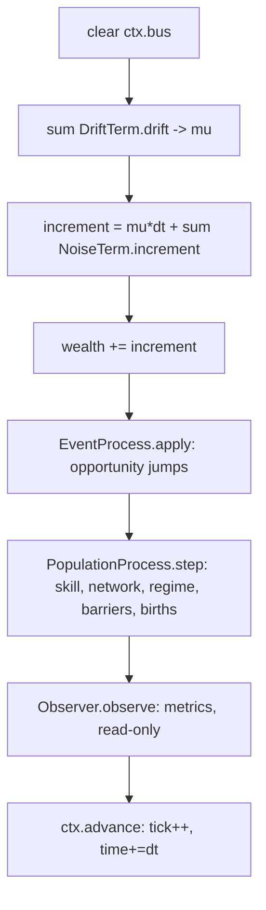
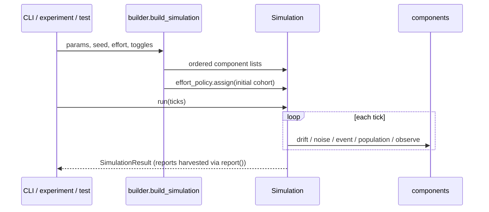
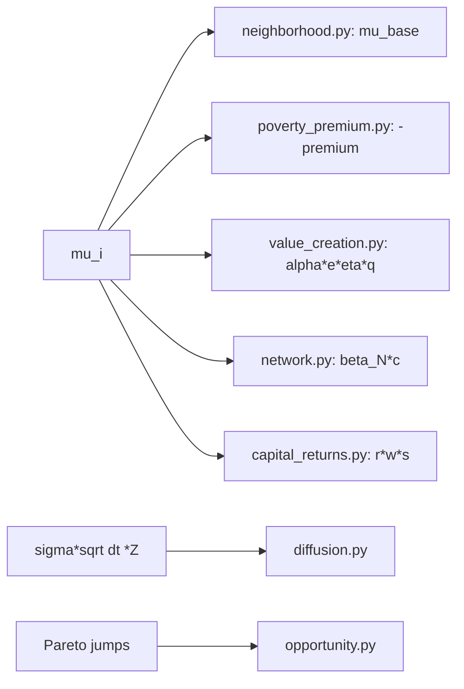
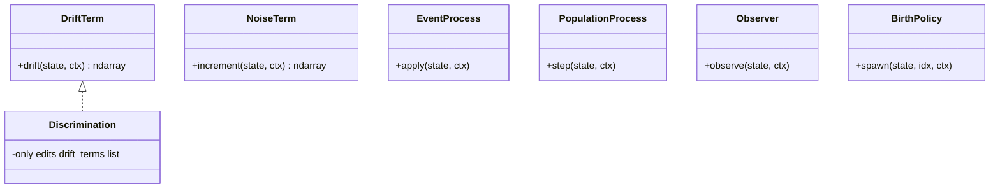

# `poverty_trap` - simulator internals

This is the engineering map of the simulator: what the modules are, how a tick
flows, who calls whom, where the equations live, how to extend it, and how to run
it. For the *model* (economics + math) see [`../../docs/README.md`](../../docs/README.md);
for the equation-to-code audit see
[`../../docs/design/model-verification.md`](../../docs/design/model-verification.md).

---

## 1. One-paragraph mental model

The engine is a tiny, model-agnostic orchestrator. It holds ordered lists of
small **components**, each implementing one tiny `Protocol`, and runs them in a
fixed order every tick. Each agent is a wealth value pushed by a drift, a random
shock, and discrete jumps, between a ruin floor and a "rich" threshold. New
behaviour is a new component, never an edit to the engine. Everything random
flows through one seeded generator, so runs are reproducible.

---

## 2. Module map



Every domain package (`dynamics`, `events`, `population`, `observe`) depends only
on `core` (state, context, protocols, config). `builder.py` wires them into the
canonical pipeline; `cli.py` and `experiments/` call the builder.

---

## 3. The tick pipeline (who runs, in what order)

`Simulation.step` runs five stages each tick. Order is fixed and meaningful.



The split between drift (scales with `dt`) and noise (scales with `sqrt(dt)`) is
why they are separate interfaces - it keeps the Euler-Maruyama integration
correct. Population processes run *after* the economic update so resolution and
births see settled wealth; observers run last and never mutate.

---

## 4. Call graph (entry points to components)



Entry points all funnel through `build_simulation`, so there is one place the
pipeline order is defined and one place to read it.

---

## 5. Where the equations live

The drift (model spec section 7.4) is the sum of independent terms:

```
mu_i = mu_base(zone) - premium*1[w<w_p] + alpha*e*eta*q + beta_N*c + r*w*s
```



| Equation (spec) | Module | Notes |
|-----------------|--------|-------|
| eta efficiency 7.2, q quality / s savings 7.3 | `dynamics/value_creation.py` | logistic helpers |
| capital returns 7.4 | `dynamics/capital_returns.py` | multiplicative -> Kesten tail 7.7 |
| diffusion 7.4 | `dynamics/diffusion.py` | sqrt(dt) scaling |
| opportunity 7.5 | `events/opportunity.py` | Poisson arrival, Pareto payoff, capture gate |
| network 7.6 | `population/network.py` | connectedness c = W @ above_line |
| generations 7.8 | `population/lifecycle.py` | SimpleRestart / GenerationalTransmission |
| regime 7.9 | `population/regime.py` | welfare floor, redistribution |
| continuum 7.10 | `core/bands.py` | five ordered bands |

---

## 6. The rules (assumptions in one place)

- A person is one wealth number plus talent, skill, zone, effort, savings,
  stressors, connectedness, generation (`state.py`).
- Born poor or rich by zone; the zone sets base drift (Chetty) and shock size.
- Effort creates value scaled by efficiency (scarcity tax) and quality (skill).
- Below the poverty line a premium drags you down (Ghatak); shocks hit harder.
- Returns on capital compound (rich pull away) -> heavy-tailed wealth.
- Opportunities arrive (more if rich/connected), pay off Pareto, captured only
  with skill + slack.
- A life resolves at ruin or the rich threshold; a child inherits wealth/talent/
  place. Two distinct outcomes are tracked: left poverty vs became rich.

Each rule cites a paper in [`../../docs/literature/calibration.md`](../../docs/literature/calibration.md).

---

## 7. Extensibility (Open/Closed)

Add a mechanism by adding a class that satisfies one protocol; do not touch the
engine. Example: a discrimination penalty.



1. add params to `ModelParams` + range check in `validate`; 2. add fields to
`AgentState`; 3. write one class with `drift/increment/apply/step/observe`;
4. append it to the relevant list in `builder.py`; 5. add a test. No engine edit.

---

## 8. Entry points and usage

| Use | Command / call |
|-----|----------------|
| CLI run | `poverty-trap run --effort 0.5 --ticks 20000` |
| CLI sweep | `poverty-trap sweep --steps 11` |
| CLI regime | `poverty-trap regime --name protective` |
| Python | `build_simulation(seed=0, effort=0.5).run(20000)` |
| Experiment | `python experiments/effort-marginal-impact/run.py` |
| Tests | `pytest` |

```python
from poverty_trap.builder import build_simulation
sim = build_simulation(seed=0, effort=0.5, generational=True)
res = sim.run(20000)
print(res.reports["FirstPassageMonitor"])  # left-poverty vs became-rich
print(res.reports["PopulationMetrics"])     # Gini, bands, wealth gap
```

Toggle v2 mechanisms with `with_opportunity` / `with_network` / `generational`;
turn all off to recover the v1 drift-diffusion baseline. Determinism: a fixed
`seed` reproduces a run bit-for-bit (`tests/test_determinism.py`).
